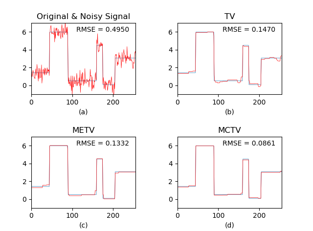

# 1D-MCTV-Denoising
This is the source code for "Minmax-concave Total Variation Denoising" (1D case).

## Paper
Du, H. & Liu, Y. **Minmax-concave Total Variation Denoising**.

*Signal, Image and Video Processing* (2018).

doi: 10.1007/s11760-018-1248-2

url: https://link.springer.com/article/10.1007/s11760-018-1248-2

## Prerequisite
- Python 3
- numpy
- scipy
- random
- matplotlib

## Usage
- For demonstration, you can simply clone the repository and run `main.py`. Denoising results of three methods TV, METV and MCTV are plotted. Below is one demo figure.

- The demo 1D piecewise constant signal (length ***N*** = 256) is saved in `signal.mat` and loaded when running `main.py`. You can modify it or use your own way to import signals.

- Feel free to explore and modify all parameter values in `main.py`. For detailed explanation of each parameter and its proper value range, please see the comment in code. 

- For MATLAB version of the source code, you can email me: <yilinl2@andrew.cmu.edu>.

- For more algorithm details, please see `tv1d.py`, `metv1d.py` and `mctv1d.py` or the relevant research paper.